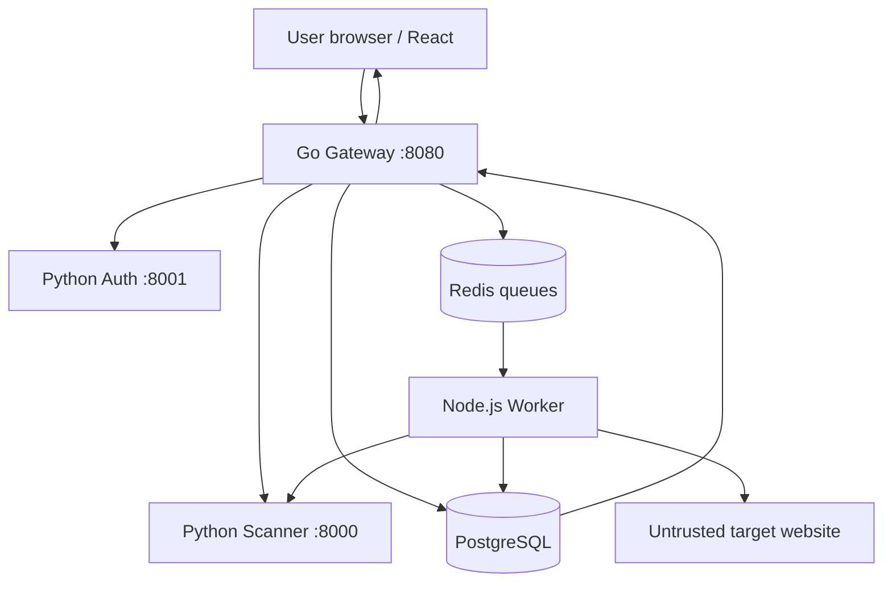

# URL Threat Scanner — Phase 1 Master Revision Guide

## Purpose

This guide explains Phase 1 as one continuous production story. Its goal is not to make you memorize source code. It is to make you capable of explaining the architecture, tracing a request, identifying security boundaries, diagnosing failures, and defending the design in an interview.

The product is a URL Threat-Scanner SaaS. A user registers, logs in, submits a URL, receives a scan ID, watches asynchronous progress, and receives a threat verdict with network evidence. Phase 1 runs locally with Docker Compose. Later phases move the same architectural boundaries into Kubernetes, AWS, CI/CD, GitOps, and observability.

---

## 1. The complete system in one picture



Only the Gateway is the public product entry point. Auth, Scanner, Worker, PostgreSQL, and Redis are internal services. React is compiled into the Gateway and executes in the user's browser; it is not a separate runtime container.

The shortest accurate memory line is:

```text
Browser → Gateway → Auth + Scanner → PostgreSQL → Redis → Worker
Worker → DNS/HTTP target → PostgreSQL → Gateway → Browser
```

---

## 2. Why these components and languages exist

### Go Gateway

The Gateway is the controlled ingress point. It serves the React UI, accepts public API requests, validates input, asks Auth to verify identity, calls Scanner for quick static analysis, creates the scan record, queues the job, and returns results.

Go was selected because it provides strong concurrent HTTP handling, an effective standard library, explicit error handling, and compilation into a self-contained binary. The final binary can run in a minimal `scratch` image without a shell or package manager, reducing image size and attack surface.

### Python FastAPI Auth

Auth owns registration, Argon2 password hashing, login, JWT creation and verification, API-key creation and verification, active-user checks, and identity lookup.

Python was selected because FastAPI, Pydantic, Argon2, JWT, and PostgreSQL libraries allow clear implementation of security-sensitive API logic. Separating Auth creates a trust boundary: password and identity behavior can be restricted, audited, and changed independently.

### Python FastAPI Scanner

Scanner performs fast static analysis of URL strings and patterns. It returns flags, a risk score, and a preliminary verdict. It does not own the asynchronous queue and does not forward jobs to Worker.

Python fits string analysis, regular expressions, threat-intelligence enrichment, data science, and the project's future AI/AIOps direction.

### Node.js Worker

Worker consumes jobs, reads and updates PostgreSQL, performs DNS resolution, makes controlled HTTP requests, calls Scanner where needed, handles retry decisions, and saves final results.

This workload is I/O-bound: most time is spent waiting for Redis, PostgreSQL, DNS, Scanner, or remote HTTP responses rather than performing CPU-heavy calculations. Node.js's asynchronous event model suits this workload. The more important design decision is isolation: Worker touches hostile internet destinations and therefore needs a different egress policy and blast radius from Gateway and Auth.

### React frontend

React supplies registration, login, URL submission, progress display, polling, and dynamic result rendering. During the Docker build, Node compiles React into HTML, CSS, and JavaScript. These files are embedded into the Go Gateway. At runtime the Gateway delivers them, and the browser executes React.

### PostgreSQL

PostgreSQL is the durable system of record. It stores users, password hashes, API-key hashes, ownership, URLs, statuses, static analysis, network results, timestamps, and worker attempts.

### Redis

Redis is temporary asynchronous job transport. Gateway produces scan IDs, Redis holds pending and processing lists, and Worker consumes them. PostgreSQL remembers business truth; Redis coordinates work.

### Why microservices

The services have different responsibilities, trust levels, scaling patterns, and network requirements. In particular, only Worker needs controlled internet-wide scanning egress, while Auth should have very restricted connectivity.

The trade-off is operational complexity: more containers, connections, configuration, logs, deployments, and failure points. Microservices are justified here by real security and workload boundaries, not because they are automatically superior to a monolith.

---

## 3. Docker and Compose story

A Dockerfile is a build recipe. An image is the packaged, read-only application template. A container is a running instance of an image. Docker Engine builds images and manages containers, networks, and volumes. Docker Compose describes how the complete local multi-container application should run.

Phase 1 contains four custom application containers and two supporting containers:

| Container | Role |
|---|---|
| Gateway | Public API and embedded React UI |
| Auth | Identity and credentials |
| Scanner | Static URL analysis |
| Worker | Asynchronous DNS/HTTP inspection |
| PostgreSQL | Durable records |
| Redis | Job transport |

### Build time and runtime

Build time installs dependencies, runs tests, compiles React, compiles Go, and creates images. Runtime starts the processes that listen for requests or consume work.

The Gateway uses multi-stage construction:

```text
Node build stage: React source → static assets
Go build stage: Go source + assets → tests → Gateway binary
Final stage: only the binary in scratch
```

`scratch` is an empty base image. It contains no shell, package manager, compiler, or normal debugging tools. This reduces attack surface but means `docker compose exec gateway sh` is expected to fail. Gateway is run as non-root user `65532:65532`.

Python and Node services require language runtimes, so they use suitable minimal runtime images rather than `scratch`. Dependency manifests are copied and installed before frequently changing application code so Docker can reuse cached dependency layers. Runtime files are owned by non-root users.

For Worker, `npm ci` installs according to `package-lock.json`; `--omit=dev` excludes development-only packages; `--ignore-scripts` blocks automatic dependency lifecycle scripts where compatible; cleaning the npm cache removes unnecessary build data. `NODE_ENV=production` enables production behavior in Node and supporting libraries.

### Compose networking

Compose creates a private network and internal DNS. Services call stable service names instead of container IP addresses:

```text
auth:8001
scanner:8000
postgres:5432
redis:6379
```

Inside Gateway, `localhost` means Gateway itself. Therefore Gateway must call `http://auth:8001`, not `http://localhost:8001`.

The mapping `127.0.0.1:8080:8080` means host address `127.0.0.1`, host port `8080`, forwarded to container port `8080`. Binding to `127.0.0.1` keeps the local service off other host interfaces. Dockerfile `EXPOSE 8080` is metadata/documentation; Compose `ports` performs actual publication.

### Configuration and secrets

Environment variables supply database URLs, Redis URLs, internal service URLs, JWT configuration, and service tokens. This separates image construction from environment-specific configuration. Local `.env` is ignored by Git. `.env.example` must contain only placeholders, never real tokens.

Production will replace local environment-secret handling with AWS Secrets Manager, External Secrets Operator, IAM-controlled retrieval, and rotation.

### Persistence

Containers are replaceable. Named volumes preserve PostgreSQL and Redis files outside one container's writable layer. `docker compose down` normally preserves named volumes; `docker compose down -v` deletes them and can destroy local state. A volume provides persistence, not a full backup or DR strategy.

### Startup and health

`depends_on` with `condition: service_healthy` helps wait for dependencies to become ready at startup. It cannot guarantee they remain available later, so applications still need timeouts, errors, and retry behavior.

Liveness asks, "Is the process alive?" Readiness asks, "Can this instance currently perform its required work?"

```text
/health → process alive
/ready  → required dependencies usable
```

Gateway can be alive while Redis is unavailable. In that case `/health` may return 200 while `/ready` returns 503. In Kubernetes this distinction controls restarts and traffic routing.

---

## 4. The complete user and scan story

### Step 1: Registration

The browser calls Gateway, not Auth directly. Gateway proxies the registration body to internal Auth and adds the internal service token. Auth validates the request, normalizes the email, checks uniqueness, hashes the password with Argon2, and stores only the password hash in PostgreSQL.

Hashing is one-way transformation, not reversible encryption. During login, Auth hashes/verifies the supplied password against the stored Argon2 value. The original password should never be stored or logged.

### Step 2: Login and JWT

On valid credentials, Auth issues a short-lived JWT. A JWT is a signed token containing claims such as subject/user ID, issuer, audience, issued-at time, expiration, and unique token ID. The signature protects integrity; normal JWT contents are encoded, not secret encryption.

The browser sends it as:

```http
Authorization: Bearer <token>
```

Gateway forwards the credential to internal Auth `/verify` together with the service token. Auth verifies signature, algorithm, issuer, audience, expiration, subject, and active-user state, then returns the authenticated user ID.

### Step 3: API keys

API keys support automation. The plaintext key is shown only when created. PostgreSQL stores a prefix for identification and a SHA-256 hash for verification, not the entire plaintext key. Keys can expire, be revoked, and record `last_used_at`.

JWTs are short-lived interactive user credentials; API keys are longer-lived automation credentials. Both establish user identity. The internal service token is different: it authenticates trusted service-to-service calls in the local design.

### Step 4: Authentication and authorization

Authentication answers, "Who are you?" Authorization answers, "What are you allowed to access?"

A scan lookup is tenant-isolated by querying both scan ID and authenticated user ID. A different authenticated user receives 404 rather than confirmation that another tenant's scan exists.

```sql
WHERE id = requested_scan_id
  AND user_id = authenticated_user_id
```

URL validation is neither authentication nor authorization; it is input/security validation.

### Step 5: Browser URL normalization

For usability, React can transform `youtube.com` into `https://youtube.com`. This convenience does not replace backend validation because clients can bypass the UI and call APIs directly.

### Step 6: Gateway validation

Gateway restricts body size, requires JSON, rejects unknown or malformed input, and permits only HTTP/HTTPS URLs. It requires a hostname, rejects embedded URL credentials and fragments, permits only ports 80/443, and rejects localhost, local hostnames, and directly supplied private/special IP addresses.

Client-side validation improves experience. Server-side validation enforces security.

### Step 7: Static analysis

Gateway calls Scanner synchronously using the internal service token. Scanner examines URL patterns such as suspicious keywords and returns flags, a preliminary score, and verdict. Synchronous means Gateway waits for this fast result before continuing.

### Step 8: Durable record

Gateway creates a cryptographically random scan ID and inserts the scan into PostgreSQL with owner, URL, status `queued`, static analysis, and timestamps. Ownership exists before the asynchronous job begins.

### Step 9: Queueing and HTTP 202

Gateway pushes the scan ID into Redis `scan-jobs`. It then returns `202 Accepted` with the scan ID. HTTP 202 means the request was accepted for later processing; it does not promise the DNS/HTTP scan is complete or successful.

If Redis enqueueing fails after PostgreSQL insertion, Gateway records a failure status such as `queue_failed` and returns service unavailability rather than falsely claiming that the job was queued.

### Step 10: Worker claim

Worker waits on Redis and atomically moves an ID:

```text
scan-jobs → scan-jobs:processing
```

Gateway is the producer, Redis is the queue/broker, and Worker is the consumer. Redis does not actively call Worker; Worker blocks while waiting and claims available work.

The processing list records claimed-but-unacknowledged work. If Worker crashes, startup recovery can move interrupted jobs back to the pending queue. This prevents silent loss.

Worker loads the record from PostgreSQL and changes `queued` to `running`, incrementing the attempt count.

### Step 11: DNS and SSRF protection

SSRF, or Server-Side Request Forgery, occurs when an attacker tricks a server into connecting to a destination the attacker should not be able to access, such as loopback, private networks, cloud metadata services, or administrative interfaces.

Worker resolves the hostname and validates every returned IP address. It rejects loopback, private, link-local, multicast, unspecified, and other special-purpose addresses. Rejecting only URL text is insufficient because a harmless-looking hostname may resolve to an internal IP.

Worker selects an approved address and pins the actual connection to it while preserving the correct hostname for HTTP Host and TLS verification. Redirect targets are parsed, resolved, and validated again. These controls reduce DNS rebinding and redirect-based SSRF risk.

The worker also enforces allowed protocols/ports, timeouts, redirect limits, and response-body limits. Outbound scanning is still high risk, which is why later Kubernetes and firewall phases add network-level egress enforcement as defense in depth.

### Step 12: HTTP inspection

Worker records controlled evidence including resolved addresses, connected address, final URL, redirects, response status, selected headers, truncation state, flags, risk score, and reputation-provider state. Reputation is currently designed but not configured.

### Step 13: Retry or permanent failure

Temporary infrastructure/network failures may be retryable. Security-policy failures such as resolving to a private address are permanent for that request and should not be retried blindly.

```text
queued → running → completed
                 → queued (retryable)
                 → failed (permanent or attempts exhausted)
```

At-least-once behavior means a job may be processed again after certain crashes. Worker operations should therefore be idempotent where possible: repeating them must not create incorrect duplicate effects.

### Step 14: Completion and acknowledgement

Worker saves the final result and status to PostgreSQL, then removes the ID from `scan-jobs:processing`. Saving before acknowledgement prevents a job from disappearing before its result becomes durable.

### Step 15: UI polling

React periodically calls `GET /scans/{id}`. Gateway authenticates the credential and authorizes the scan using both ID and user ownership. React changes the display from `queued` to `running` to `completed` or `failed` and renders evidence.

---

## 5. Security controls implemented in Phase 1

| Area | Current control | Purpose |
|---|---|---|
| Passwords | Argon2 hashes | Avoid plaintext password storage |
| Sessions | Short-lived signed JWTs | User authentication |
| Automation | Hashed, expiring, revocable API keys | Programmatic access |
| Internal calls | Service tokens | Local service authentication baseline |
| Tenant isolation | Query by scan ID and user ID | Prevent cross-user access |
| Input | Body limits and strict JSON | Reduce malformed/oversized requests |
| URL | Scheme, host, port and credential rules | Reduce unsafe input |
| SSRF | Resolve all IPs and block special ranges | Protect internal destinations |
| DNS | Pin approved connection address | Reduce DNS rebinding window |
| Redirects | Revalidate every target | Prevent redirect bypass |
| HTTP | Time, redirect and body limits | Limit resource abuse |
| Containers | Non-root users | Reduce compromise impact |
| Images | Multi-stage/minimal runtimes | Reduce attack surface |
| Dependencies | Lockfiles/reproducible installs | Improve build consistency |
| Secrets | `.env` ignored; examples use placeholders | Prevent source-control leakage |
| Logging | Structured application events | Support operations and future AIOps |

Current service tokens and local `.env` handling are lab baselines, not final production identity. Future phases add Network Policies, workload identity, Secrets Manager, External Secrets, CI security gates, runtime detection, and firewall enforcement.

---

## 6. Failure and ownership matrix

| Failure | What still works | What fails | First evidence |
|---|---|---|---|
| Gateway stopped | Internal containers may run | UI and all public API access | `compose ps`, Gateway logs |
| Auth unavailable | Existing backend data remains | Login and protected requests | Gateway/Auth logs, readiness |
| Scanner unavailable | Other dependencies may run | New static analysis/scan submission | Gateway/Scanner logs |
| PostgreSQL unavailable | Processes may remain alive | Identity, persistence, results | `/ready`, PostgreSQL health/logs |
| Redis unavailable | Existing completed results may remain retrievable | New async job delivery | `/ready`, Redis ping, Gateway logs |
| Worker stopped | UI/login and queueing may work | Jobs remain queued; no final inspection | Queue length, Worker state/logs |
| Target DNS failure | Platform remains healthy | Individual scan fails/retries | Worker structured event |
| Private-IP target | Platform remains healthy | Scan rejected as security failure | Worker error code |
| Worker crashes mid-job | Other services continue | Claimed job pauses | Processing list, Worker logs |
| Bad service token | Services are reachable | Internal request receives auth failure | Caller and callee logs |
| Wrong internal URL | Container may remain running | Service-to-service connection | Environment/config, DNS test |
| Old image after code change | Stack may appear healthy | New behavior absent | Image/build history; rebuild |

The NOC-to-DevOps troubleshooting pattern is the same: determine scope, identify the first failing dependency boundary, gather evidence, restore safely, validate end-to-end, and document cause.

---

## 7. Operational troubleshooting order

Do not rebuild everything before identifying the failure.

```bash
docker version
docker compose config --quiet
docker compose ps -a
docker compose logs --tail=100 <service>
curl -i http://127.0.0.1:8080/health
curl -i http://127.0.0.1:8080/ready
docker compose exec redis redis-cli ping
docker compose exec postgres psql -U threatscanner -d threatscanner -c "SELECT 1;"
```

Interpretation:

1. `docker version`: confirm both client and server/engine respond.
2. `compose config --quiet`: validate Compose syntax and interpolation.
3. `compose ps -a`: see running, unhealthy, and exited containers.
4. `compose logs`: identify the application error before changing anything.
5. `/health`: verify Gateway process liveness.
6. `/ready`: verify required dependency readiness.
7. Redis/PostgreSQL commands: test dependencies directly.

Then verify internal service names, ports, credentials, environment variables, common network attachment, database schema, and image freshness.

Useful lifecycle commands:

```bash
docker compose up --build -d        # build changed code and start
docker compose up -d --no-build     # start using existing images
docker compose stop                 # stop without removing
docker compose start                # start existing stopped containers
docker compose down                 # remove containers/network, keep named volumes
docker compose logs -f worker       # follow Worker logs
```

If source code changed and `--no-build` is used without an earlier build, the container runs the previous image and therefore old code.

---

## 8. Local design versus production evolution

| Phase 1 local design | Production direction |
|---|---|
| Docker Compose | Kubernetes locally, then EKS |
| One machine | Multiple nodes and availability zones |
| Compose DNS/network | Kubernetes Services and Network Policies |
| Local `.env` | Secrets Manager + External Secrets |
| Shared service token | Workload identity/mTLS/rotated credentials |
| Redis lists | Hardened/managed queue strategy |
| Local PostgreSQL volume | Managed database, backups, encryption and DR |
| Embedded React assets | Potential S3/CloudFront delivery |
| Manual builds | GitHub Actions security pipeline |
| Manual deployment | Argo CD reconciliation |
| Basic logs | Prometheus, Grafana, Loki and Alertmanager |
| Application SSRF rules | Network/firewall egress defense in depth |

The local design is not presented as production-complete. It proves product behavior and service boundaries cheaply before paid cloud infrastructure is created.

---

## 9. Core terminology

- **API:** Defined interface through which software communicates.
- **Endpoint:** An HTTP method and path, such as `POST /scans`.
- **Synchronous:** Caller waits for the operation's response.
- **Asynchronous:** Work continues after the original request returns.
- **Stateless service:** Durable business state is not tied to one instance.
- **Stateful service:** Stores information that must survive requests/restarts.
- **System of record:** Authoritative durable location for business data.
- **Authentication:** Proving identity—who are you?
- **Authorization:** Deciding permitted actions/resources—what may you access?
- **Tenant isolation:** Preventing one customer's/user's data from being accessed by another.
- **Hashing:** One-way derivation used for verification, not reversible encryption.
- **JWT:** Signed claims token used here for short-lived user sessions.
- **I/O-bound:** Limited mainly by waiting for networks, databases, or storage.
- **Producer:** Component adding work; Gateway.
- **Queue/broker:** Component holding work; Redis.
- **Consumer:** Component claiming work; Worker.
- **Atomic operation:** Completes as one indivisible state change.
- **Acknowledgement:** Confirmation that claimed work is finished.
- **Idempotent:** Safe to repeat without incorrect additional effects.
- **SSRF:** Tricking a server into requesting forbidden/internal destinations.
- **DNS rebinding:** DNS answers change to redirect a trusted hostname toward a forbidden address.
- **Attack surface:** All exposed code, interfaces, packages, and privileges an attacker could target.
- **Blast radius:** Extent of damage or disruption caused by a failure or compromise.
- **Liveness:** Whether a process should be considered alive/restarted.
- **Readiness:** Whether an instance should currently receive traffic.
- **Image:** Read-only packaged application template.
- **Container:** Running instance of an image.
- **Volume:** Persistent storage independent of one container lifecycle.
- **Service discovery:** Resolving logical service names to reachable instances.

---

## 10. Interview-ready project explanation

> I built an asynchronous URL threat-scanning SaaS using four independently containerized application services. A Go Gateway is the only public entry point and also serves an embedded React UI. A Python FastAPI Auth service manages Argon2 password hashes, short-lived JWTs, and hashed API keys. A Python Scanner performs fast static URL analysis. The Gateway stores tenant-owned scan records in PostgreSQL and publishes scan IDs to Redis. A Node.js Worker claims jobs reliably, performs DNS and controlled HTTP inspection against untrusted destinations, applies SSRF protections, and persists final results.
>
> Scanning is asynchronous because DNS and remote HTTP behavior are slow and unpredictable. The API returns `202 Accepted`, and the UI polls the scan resource. Redis uses pending and processing lists so a Worker crash does not silently lose claimed work. PostgreSQL remains the durable system of record.
>
> The primary security decision is isolation of hostile outbound scanning from public ingress and identity services. We validate all resolved addresses, block private and special ranges, pin an approved connection address, and revalidate redirects. Authentication identifies the caller, while authorization queries both scan ID and user ID for tenant isolation. Containers run as non-root with language-specific multi-stage builds and minimal runtime images.
>
> Phase 1 uses Docker Compose to prove the complete workflow locally. The next phase moves the services to local Kubernetes with Services, probes, ConfigMaps, Secrets, resource controls, and Network Policies before any paid AWS environment is created.

---

## 11. Midnight recall sheet

### Architecture

```text
Go Gateway      = public ingress and orchestration
Python Auth     = identity and credentials
Python Scanner  = quick static analysis
Node Worker     = slow/risky network inspection
PostgreSQL      = durable truth
Redis           = work coordination
React           = browser interface embedded through Gateway
```

### Request flow

```text
1. User authenticates.
2. Gateway verifies identity through Auth.
3. Gateway validates URL.
4. Scanner returns static analysis.
5. Gateway saves tenant-owned record in PostgreSQL.
6. Gateway queues scan ID in Redis and returns 202.
7. Worker moves ID to processing and marks running.
8. Worker validates DNS and inspects HTTP safely.
9. Worker saves result, marks completed/failed, and acknowledges.
10. React polls Gateway; Gateway enforces ownership and returns result.
```

### Five sentences that must never be confused

```text
Scanner does not forward jobs to Worker; Redis connects them asynchronously.
Redis coordinates work; PostgreSQL stores durable business truth.
Authentication proves identity; authorization controls access.
React runs in the browser; Node only compiles it during the Gateway build.
Health means alive; readiness means capable of serving required work.
```

### Incident order

```text
Engine → Compose state → logs → health → readiness → dependency tests
→ configuration/network → data/queue state → end-to-end validation
```

### Production reasoning

```text
Build locally → prove behavior → secure boundaries → add Kubernetes
→ automate CI/CD → deploy cloud briefly → capture evidence → tear down
```

---

## 12. Phase 1 completion statement

Phase 1 proves that the complete product works locally: users can register and authenticate, create API keys, submit URLs, receive asynchronous scan IDs, observe state transitions, and retrieve tenant-isolated static and network results. The system demonstrates language-specific container builds, internal service communication, durable persistence, queue recovery, SSRF-aware outbound inspection, structured logs, health/readiness endpoints, and a dynamic React interface.

Deferred improvements such as stronger workload identity, Kubernetes network enforcement, full security headers, rate limiting, expanded test coverage, reputation integrations, GeoIP/ASN enrichment, caching, observability, cloud infrastructure, CI/CD security gates, and AI-assisted operations belong to later phases rather than being silently treated as completed.

Phase 2 should preserve this working application and change the orchestration layer from Docker Compose to local Kubernetes. The first Phase 2 objective is not AWS. It is to run the same services locally using Kubernetes objects and then prove service discovery, configuration, probes, persistence, and Network Policies.
